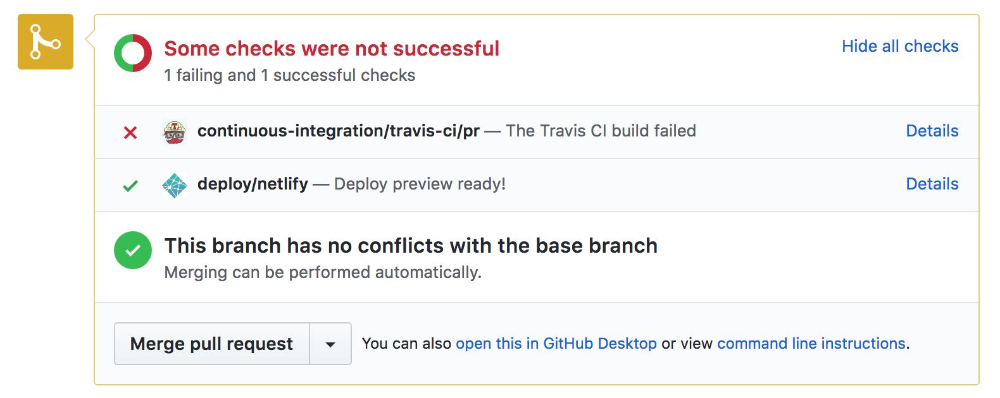

Continuous Deployment using Netlify
===================================

`Netlify`_ allows you to trigger a build, and more importantly a deployment, of
a sphinx project based on `GitHub commits`_ and `pull requests`_. Thus creating the
continuous deployment portion of the pipeline.

Using `PR #3`_ as an example, you can see it has a **Details** link to the
`latest netlify build specific to that PR`_.

   This is a PR that caused a failed build.

Although, since unfortunately we can't trigger a Netlify build based on a
`Travis-CI`_ build status we have to add a `custom script`_ to the `Travis-CI
configuration`_. Since we only want to deploy the site if the project passes the
continuous integration process we need to use `Netlify's restore deploy
feature`_ on build failures.

.. note:: It is possible for their to be a brief window where the failed
   `Netlify`_ build is published before the restore deploy call is run.

.. _custom script: https://github.com/jdillard/continuous-sphinx/blob/master/restore.sh
.. _GitHub commits: https://github.com/jdillard/continuous-sphinx/commits/master
.. _latest netlify build specific to that PR: https://deploy-preview-3--continuous-sphinx.netlify.com/
.. _Netlify: https://www.netlify.com/
.. _Netlify's restore deploy feature: https://www.netlify.com/docs/api/#deploys
.. _PR #3: https://github.com/jdillard/continuous-sphinx/pull/3
.. _pull requests: https://github.com/jdillard/continuous-sphinx/pulls
.. _Travis-CI: https://travis-ci.org/
.. _Travis-CI configuration: https://github.com/jdillard/continuous-sphinx/blob/master/.travis.yml
